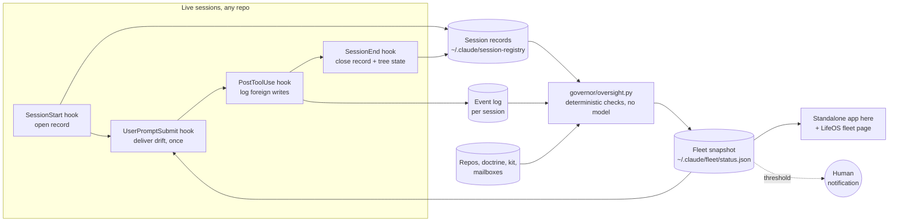

> **Origin.** autonomous standing integrator, 2026-09-26, answering the
> human's chat asks of the same day. Grounded in: Decision 47 (VSM adopted),
> Decision 42 (TCC: launchd cannot read `~/Documents`), Decision 76 (boards
> routine), `governor/monitor.py`, `kit/hooks/`, `kit/session/registry.py`,
> `handbook/GAP-SCHEMATIC.md` (algedonic channel, uncertainty channel),
> `briefs/2026-09-19-gardener-loop-and-fence.response.md` (the Fence).

# Session oversight: one loop over live sessions, hands-off boundaries, a real dashboard

## The one-paragraph version

Every Claude session in every repo already runs three hooks: one at start,
one on every prompt, one at end. Today they carry a brief, a PR status line,
and a memory sync. This proposal makes them the body of an oversight loop:
the start and end hooks open and close each session's record automatically,
with enough facts to know what that session was built against; a
deterministic engine compares every open session with the current state of
the whole system and writes one snapshot file; the prompt hook tells each
live session, once, only what has drifted for it; and a LifeOS page shows the
human the same snapshot. No model sits in the checking path; no agent talks
to another; the human is paged only past a threshold.

## Mapped to the Viable System Model

| VSM | In this design | Exists today? |
|---|---|---|
| **S1** — operations | each live Claude session, in its repo | yes |
| **S2** — anti-oscillation between S1 units | collision and sync signals, delivered into sessions through the prompt hook: two sessions in one repo; a provider changed a contract a live consumer session depends on; `main` moved under a working branch | partly: the PR hook reports `behind origin/main` |
| **S3\*** — audit that bypasses self-report | `governor/oversight.py`: reads trees, the registry, and hook event logs, never what an agent says it did | the fleet sweep audits repos; nothing audits sessions |
| **S3** — direction, resource bargain | the human at the dashboard and at ratification gates | yes, via boards |
| **Algedonic** | threshold findings leap straight to the human (notification), and — only if the human arms it — the designed HALT sentinel | fleet-level weekly alarm only |
| **S4** | unchanged: the monthly landscape audit | yes |
| **S5** | unchanged: doctrine + the human | yes |

The load-bearing row is S3\*: an oversight system that asks sessions how
they are doing is not oversight. Every check below is computed from files.

## Architecture

**Why the snapshot lives under `~/.claude/`.** A LifeOS server started at
login by launchd cannot read `~/Documents` (Decision 42). The hooks run inside
Claude, which can; they write the snapshot where any process can read it, and
the dashboard reads only that one file.

**When the engine runs.** Asynchronously at every session start and end (the
fleet sweep already runs this way), and at each tick of the existing
scheduled task once it is repointed from publishing boards to running the
engine. Per prompt, the hook does only cheap, local checks for its own
session and reads the rest from the snapshot, so a prompt is never slowed by
a fleet scan.

## The session record (what the start hook writes)

Today a registry row is repo name, session id, machine, open time. That
cannot answer "is this session in sync". The record gains:

| Field | Why |
|---|---|
| `path` (`~`-relative) | locate the tree without guessing from a name |
| `head_at_open`, `branch_at_open` | detect `main` moving underneath the session |
| `doctrine_sha` | the hash of `DOCTRINE.md` the session loaded; a later change means the session is working to rules that no longer exist |
| `kit_version`, `commands_sha` | kit and installed commands the session started with |
| `closed_at`, `close_state` (end hook) | `clean`, `dirty: N files`, `unpushed: N`, `on branch X without PR` — how it was left, recorded without judgment |

Records never contain file contents, prompts, or identity beyond the machine
label (the existing registry rule).

## The checks (all deterministic, each with a planted-bad fixture)

| # | Check | VSM | Severity | Delivered to |
|---|---|---|---|---|
| 1 | Doctrine changed since this session opened | S3\* | inform | that session, once: "re-read DOCTRINE.md; changed in PR #N" |
| 2 | Kit or installed commands changed since open | S3\* | inform | that session |
| 3 | `main` moved since open while the session is on a branch | S2 | inform | that session |
| 4 | Two open sessions in the same repo | S2 | warn | both sessions + dashboard |
| 5 | A provider changed a contract, notice, or pin a live consumer depends on | S2 | warn | the consumer session |
| 6 | This repo's mailbox has an overdue thread or an unread answer | S2 | inform | that session (the start brief already does this; now mid-session too) |
| 7 | A write outside this repo other than its own mailbox slot in another repo (writes-stay-home) | S3\* | **alarm** | human + session |
| 8 | Verify red or unrecorded at HEAD for more than N prompts after edits | S3\* | warn | session + dashboard |
| 9 | Session closed dirty, unpushed, or on a branch with no PR | S3\* | warn | dashboard (the next `/wakeup` in that repo) |
| 10 | Session record open with no end event past the stale line (crash, force-quit) | S3\* | warn | dashboard |
| 11 | Kit currency requirement newly unmet in a repo with a live session | S3\* | inform | that session |

Check 7 is the only alarm at launch, because it is the one the doctrine
treats as a rule, not a preference, and it is exact: the write hook already
receives every written path. It is report-only; blocking is the Fence's job.

**Anti-noise rules, from this repo's own record.** Each finding has a stable
id; a session is told about a given finding once, and again only if it
worsens. A check that produces a false positive is fixed the same day or
disabled with a DECISIONS line — never tolerated (the 20-false-HIGH lesson,
Decision 71). The dashboard shows counts by severity first, detail second.

## What changes for the human

- **Stop running `/wakeup` and `/breakdown` for bookkeeping.** Opening and
  closing the record is automatic. `/wakeup` stays for the judgment part
  (pruning reflections); `/breakdown` stays for the narrative handoff, and the
  handoff is now written as work proceeds — each time a PR opens — instead of
  at an exit nobody can predict.
- **Oversight moves to one glance.** The LifeOS fleet page shows live
  sessions, what drifted, sessions left dirty, threads owed, alarms. You open
  a repo only when the page says it needs you.
- **Alarms interrupt; nothing else does.** Everything below alarm waits on
  the page.

## Phases, each with a gate you verify

| Phase | Builds | Gate |
|---|---|---|
| **O0 — Hands-off boundaries** | Start hook opens the record with the new fields; end hook closes it with tree state; migration closes today's stale rows as `unclean, swept` | For one week, every session that exits normally closes its own record; the only stale rows are crashes |
| **O1 — Oversight engine + snapshot** | `governor/oversight.py`, checks 1–11, `fleet-status.1` contract, one planted-bad fixture per check | Every check fires on its plant and is silent on a clean fleet; snapshot validates against the contract |
| **O2 — In-session delivery** | Prompt hook injects new findings for its own session, deduped | A week in which you judge every injected finding worth having been told |
| **O3 — Dashboard** | Brief to life-os-app/life-os-web: an API endpoint reading the snapshot and a fleet page rendering it | The page replaces the boards for a week; then the artifact boards and the `fleet-boards` task retire |
| **O4 — Escalation** | Threshold alarms notify you; HALT sentinel armed only by you, per repo | Deferred until O2's noise is measured |

O0 and O1 are entirely this repo's; O3 is a cross-repo brief with the contract
landing here first. Nothing is automated past reporting until you have seen a
week of its output.

## What this does not do

- It does not make an agent the overseer. A model may later summarise the
  snapshot for the page (advisory), never decide a finding.
- It does not stop a session. Blocking a destructive act is the Fence; halting
  a session is O4 and yours to arm.
- It does not message between sessions. Every signal is a file a hook reads
  (stigmergy; Decision 73's line on live messaging holds).
- It does not see what a crashed session did after its last hook fired;
  check 10 names the gap instead of hiding it.

## Relationship to open work

- **The Fence** (gardener brief, Workstream A) is pre-action and per call;
  this is post-hoc and per session. Check 7 is a report-only preview of one of
  the Fence's rules, and its event log is the Fence's audit log's natural
  home when that ships.
- **K5** (Decision 76): the boards routine becomes the engine's timer in O1
  and retires with the boards in O3.
- **Phase R** (recursive VSM): the same record-check-deliver loop at repo
  level and at fleet level is the demonstration Phase R's gate asks for.
