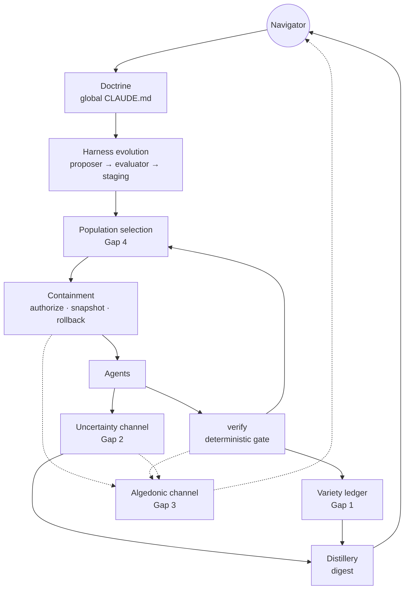
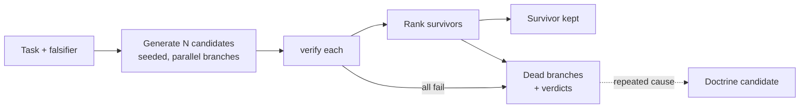
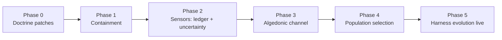

# Autonomous — Gap Integration Schematic

*Edition 2026-09-20 · author: Julian Smith · living document — this Markdown
file is the source; the PDF under `exports/` is a rendering of it. The
coverage matrix carries an* **Audit** *column added by the resident on
2026-09-20 (kit 2.6.3, Decision 75); everything else is the author's text.
The document's own rule applies: status is a claim to be verified against the
repo, not a fact.*

## Coverage matrix

Ten of the fourteen principles are already embodied or briefed in
`autonomous`; four have no component. This matrix is the audit's baseline:
status is a claim to be verified against the repo, not a fact.

| # | Principle | Status (claimed) | Existing or briefed component | Gap | Audit 2026-09-20 (resident) |
|---|---|---|---|---|---|
| 1 | Design the seam | Partial | Oracle discipline draws the human/agent/code boundary | Seams are drawn but not declared per capability; no failure-surface contract | **Partial, but the cited component is wrong.** Per-capability contracts exist at the repo seam: providers publish `INTEGRATION.md`, organs carry a versioned `contract/` dir, and INTEGRATIONS rule 2 ("consume-when-connected, degrade visibly") is a failure-surface contract. What is missing is the same declaration *inside* a repo, per capability. |
| 2 | Requisite-variety ledger | Missing | — | Gap 1 | **Confirmed missing.** No ledger, no proxies, no mutation score anywhere in the fleet. |
| 3 | Verifier is the model | Built | `./verify` gates, never-weaken rule, seeded runs | No fidelity measure (mutation score) | **Confirmed.** Seeding is doctrine (AI/deterministic boundary: seeded RNG, no wall-clock in cores), enforced by convention not by a gate. |
| 4 | Judge by what it does | Built | "Passing ≠ done" | Falsifier not required as a task input | **Confirmed.** Falsifiers are required per *lesson* (LIBRARY entries) and per *notice verification*, never per task. |
| 5 | Generate loosely, decide strictly | Built | AI proposes, deterministic code decides | — | **Confirmed.** Reinforced by Decision 73: an automated reviewer is independent only if separately sourced. |
| 6 | Autonomy ∝ reversibility | Briefed | Containment layer: pre-action authorization, snapshot, rollback | Not yet built; precondition for everything below | **Confirmed briefed** — `briefs/2026-09-19-gardener-loop-and-fence.md`, Workstream A. The permission layer that exists today (`.claude/settings.json` allow/deny + the pre-tool blocklist) is command-name matching, which the brief itself rules out as not reproducible safety. |
| 7 | History is a tree | Adopted | Tree-based branching history as a standing principle | Dead branches not recorded with verdicts | **Not adopted in the repo.** No doctrine tenet, decision, or design section states it; the phrase appears only in the author's brief. Git branches plus append-only DECISIONS and "supersede, don't erase" (DESIGN §4b) are the nearest practice. Status should read *Missing (principle held by the author)* until a Phase 0 doctrine patch lands. |
| 8 | Nested loops, rate-separated | Partial | Verify (commit), distillery digest (week) | Session loop has no explicit comparator; seeding not enforced | **Partial, more built than claimed.** The session loop has a comparator: `/wakeup` reads `SESSION.md` and a recorded verify result and refuses to trust one from another commit; `/breakdown` writes the account the next session trusts. The week loop exists as the weekly algedonic run, the weekly kit cadence (Decision 68), and the monthly landscape audit. "Digest" today is *dispatch's daily* digest; distillery produces no weekly digest yet. |
| 9 | Regulate the regulator | Briefed | Harness-evolution outer loop: proposer → evaluator → human-gated staging | Not yet built; needs rate limit (≤1 promotion/week) | **Confirmed briefed** — same brief, Workstream B. Rate separation already governs the *kit*: fleet-affecting changes ship at most weekly (Decision 68). |
| 10 | Diagnose, don't explain | Partial | Bisection is cheap given the tree | No diagnostic protocol in doctrine | **Partial, wrong reason.** There is no tree (row 7). The practised protocol is "plant a known-bad and watch the detector fire before trusting it" (LIBRARY L0002, L0014) — a discriminating observation, which is this principle applied to detectors. Reproduce-bisect-ablate is not written anywhere. |
| 11 | Unknowns have a shape | Missing | Vertex protocol (ignorance topology, human-side) | Gap 2 — no agent-side channel | **Confirmed.** Vertex is a separate repo for the human's own reconnaissance; no agent emits a structured uncertainty record. |
| 12 | Algedonic channel | Missing | — | Gap 3 | **Wrong: it exists.** `governor/algedonic.py` runs weekly on a GitHub runner, deterministic, no model calls (Decision 47 amendment D): default-branch CI red or a machine-identity leak in a public tree exits 2 and notifies the human, bypassing every local sweep. Scope is *fleet, remote-visible* pain only. What Gap 3 designs — per-run triggers (leash breach, verifier tamper, budget overrun) that halt a run — is genuinely missing. Status should read *Partial (fleet-level channel live; run-level triggers missing)*. |
| 13 | Constrain the program space | Built | FOUNDATIONS shared library; global CLAUDE.md conventions | Allowed-dependency list not enforced | **Partial, not built.** FOUNDATIONS is a trellis for one project family (audio plugins), not the fleet. New dependencies are a *human gate* (ONBOARDING residency rule 6), which is a prose rule, not an enforced list. |
| 14 | Populations and pruning | Missing | — | Gap 4 | **Confirmed missing.** Every task today produces one candidate. |

The partial rows are cheap doctrine changes; the four gaps are components and
get their own sections.

**Audit summary.** Two rows are materially wrong (7 claimed adopted, is not;
12 claimed missing, is partly live) and three understate what exists (1, 8,
13's neighbour 10). The corrected count is *nine embodied or briefed, one
partly live, four missing*. Nothing in the target architecture below changes
as a result; row 12's correction means Gap 3 starts from a working fleet-level
alarm and adds run-level triggers rather than starting from nothing.

## Target architecture

The four gap components attach to existing seams rather than adding new ones.
The ledger and uncertainty channel are sensors feeding the distillery; the
algedonic channel is a flat wire to the navigator; population selection wraps
the proposer stage that already exists in the harness-evolution loop.

Solid arrows are the control path, top to bottom and back through the digest.
Dotted arrows are the algedonic path, which any sensor can raise and which
reaches the navigator without passing through the digest.

| Component | Loop | Reads from | Writes to | Owner |
|---|---|---|---|---|
| Variety ledger | Commit, Week | verify results, repo metrics, config schema | distillery; algedonic on gap growth | verify |
| Uncertainty channel | Session | agent structured output | distillery; population ranking; algedonic on threshold | agents |
| Algedonic channel | All | containment, verify, uncertainty, cost meter | navigator (halt + page) | containment |
| Population selection | Session | proposer, verify, ledger, uncertainty | branch tree (survivors + dead branches) | harness evolution |

## Gap 1 — Variety ledger

The ledger pairs every source of system variety with its verifier match and
trends the gap. It does not compute absolute variety, which is intractable and
observer-relative; it computes unregulated variety, the quantity that predicts
silent failure.

**Data model.** One row per variety source per repo, updated at every verify
run.

| Field | Meaning |
|---|---|
| source | Named variety source: config dimension, public API surface, dependency edge count, change entropy, type cardinality, model call site |
| measure | Current proxy value, with the proxy named |
| match | The verifier dimension paired with it: tested combinations, contract tests, coverage in churned files, property checks |
| match_measure | Current value of the match |
| gap | measure − match_measure, normalized per source |
| gap_trend | Slope over the last N verify runs |
| owner | Component responsible for closing the gap |

**Proxies, cheapest first.** Cyclomatic complexity summed; dependency-graph
edges and cycles; configuration dimensionality (count of independent flags and
enum parameters, their product logged); Shannon entropy of commits across
files over a window; algebraic type cardinalities where the language exposes
them; compressed repo size.

**The one fidelity measure.** Mutation score is the direct operationalization
of the regulator ratio: fraction of induced perturbations the verifier
detects. Run it weekly per repo, not per commit; it is expensive and its value
is in the trend.

**Minimum viable version.** A script under `verify` that emits a JSON ledger
of three sources (config dimensionality, dependency edges, change entropy)
against three matches (tested config combinations, contract-test count,
coverage in files touched this week), plus mutation score weekly. The
distillery renders the gap trend in the digest.

**Rules the ledger enforces**

- A verify run that introduces a new source with no match fails, with the
  missing match named.
- A gap whose trend is positive for three consecutive weeks raises an
  algedonic signal.
- Agents may propose matches; only verify may record them.

**Audit checks**

- [ ] Every config flag and enum parameter in the repo appears as a ledger source.
- [ ] Every ledger source has a non-empty match.
- [ ] Mutation score has been recorded at least once in the last 14 days.
- [ ] No gap trend has been positive for three weeks without an open ledger debt.

## Gap 2 — Uncertainty channel

The uncertainty channel is a structured side-output every agent emits
alongside its work, kept separate from the work itself so it cannot be buried
in prose. It gives unknowns a shape the system can act on: rank by, halt on,
and accumulate into the unknowns map.

**Schema.** One record per agent turn, appended to a session log that the
distillery reads.

| Field | Type | Meaning |
|---|---|---|
| task_id | string | The task and branch this turn belongs to |
| claims | list | What the agent asserts it accomplished, each as a falsifiable statement |
| unverified | list | Claims the agent made no attempt to verify, with the reason |
| assumptions | list | Facts the agent relied on without checking |
| unknowns | list | Things the agent needed and could not determine |
| confidence | 0–1 | The agent's own estimate that the falsifier will hold |
| blast_touched | list | Files, services, and config the turn actually modified |

**How agents emit it.** The doctrine requires the record as a fenced block at
the end of every turn, parsed deterministically. A turn without a parseable
record is rejected by containment before its changes are authorized. This is
the only place the agent's self-report is treated as data rather than as a
claim, and it is treated as data about the agent's uncertainty, never as
evidence about the code.

**Where it lands.** The session log feeds three consumers. Population
selection uses `confidence` and the length of `unverified` as tie-breakers
below the verifier. The distillery aggregates `unknowns` and `assumptions`
into the unknowns map with counts and first-seen dates. The algedonic channel
watches for thresholds.

**How it gates.**

- `blast_touched` is diffed against the containment authorization; any file
  outside the leash halts the run.
- `confidence` below a per-task floor, or falling across three consecutive
  turns, halts the run and pages the navigator.
- An item in `unknowns` that has appeared in more than five sessions becomes a
  ledger debt.

**Minimum viable version.** A doctrine clause specifying the fenced block, a
parser in containment that rejects turns without it, and a distillery job that
renders the unknowns map as a table in the digest.

**Audit checks**

- [ ] Every session log turn has a parseable uncertainty record.
- [ ] `blast_touched` matches the containment diff on every authorized turn.
- [ ] The unknowns map in the digest is non-empty and dated.
- [ ] No unknown has appeared in more than five sessions without a ledger entry.

## Gap 3 — Algedonic channel

The algedonic channel is a flat alarm path: any sensor at any loop can raise a
signal that halts the affected run and reaches the navigator directly, without
passing through the digest or the loop above. Control is nested; alarm is
flat. It lives inside containment because containment already owns halt and
rollback.

**Triggers.** Each trigger names its sensor, its threshold, and the halt scope.

| Trigger | Sensor | Default threshold | Halt scope |
|---|---|---|---|
| Leash breach | containment | any write outside authorized blast radius | run, with rollback to last snapshot |
| Verifier tamper | verify | any change to a verify file not tagged as a human-gated proposal | run |
| Budget overrun | cost meter | 150% of task token or wall-clock budget | run |
| No-progress loop | verify | 5 consecutive commits with no change in verdict set | run |
| Confidence collapse | uncertainty channel | below task floor, or falling 3 turns in a row | run |
| Ledger divergence | variety ledger | any gap trend positive for 3 weeks | none; page only |
| Invariant violation | verify | any property-check failure on a previously passing invariant | run |
| Snapshot failure | containment | snapshot or restore fails | all runs in the repo |

**Routing.** A signal writes one record (trigger, sensor, value, threshold,
task, branch, timestamp) to an alarm log, executes the halt, then pages the
navigator through whatever channel is configured. It never waits for the
digest. It never suppresses itself; only the navigator can acknowledge.

**Halt semantics.** Halt means: stop the agent, freeze the branch, roll back
if the trigger's scope says so, and mark the branch `halted` in the tree with
the alarm record attached. A halted branch is not a dead branch until the
navigator prunes it.

**Re-tuning rules.** Thresholds are doctrine and change only at the week
loop. A threshold that fires more than three times in a week on false
positives is a re-tuning candidate; it is never muted mid-week. The evaluator
in the harness-evolution loop may propose thresholds, subject to the same
staging as any harness change.

**Minimum viable version.** A single `alarm()` function in containment with
the leash-breach, verifier-tamper, and budget-overrun triggers; an append-only
alarm log; a page via the navigator's preferred notification path. Add the
remaining triggers as their sensors come online.

**Audit checks**

- [ ] Every trigger in the table has a live sensor or is marked pending.
- [ ] The alarm log is append-only and has no gaps in sequence.
- [ ] Every alarm in the last week has a navigator acknowledgement.
- [ ] No threshold was changed outside a week-loop entry.

## Gap 4 — Population selection

Population selection replaces repair with selection: for any task, several
candidates are generated in parallel branches, all pass through the verifier,
and survivors are ranked while the rest are recorded as dead branches. It
wraps the proposer stage the harness-evolution loop already defines and
applies it to ordinary work, not only to harness changes.

**Candidate generation.** N defaults to 3 for routine tasks and 5 for tasks
touching more than one component; the navigator may override per task. Each
candidate runs on its own branch with its own seed, under the same containment
authorization and budget share. Candidates may differ by prompt variant,
model, or temperature; the variation axis is recorded on the branch.

**Ranking.** Deterministic, in order, no ties broken by judgment:

1. Verifier verdict set (a candidate failing any gate is not ranked).
2. Ledger cost: net change in unregulated variety introduced.
3. Uncertainty channel: higher `confidence`, shorter `unverified`.
4. Diff size, smaller first.

The navigator sees the ranked list and the top candidate's uncertainty record.
The default action is accept the top; override requires a one-line reason
logged on the branch.

**Pruning and the dead-branch record.** Every non-survivor is marked `dead` in
the tree with its verdict set, ranking position, variation axis, and
uncertainty record attached. Nothing is deleted. The distillery reads dead
branches weekly and reports any cause that recurs across three or more tasks;
a recurring cause is a doctrine candidate for the week loop.

**Component replaceability.** Because every candidate carries its own seed
and full uncertainty record, any candidate can be regenerated on a different
model or harness version. This is the operational form of the fast-food
principle: no single agent session is load-bearing.

**Minimum viable version.** A `populate` command that takes a task file,
forks N branches, dispatches the proposer on each, runs verify on each, and
writes a ranked manifest. Ranking by verdict and diff size only until the
ledger and uncertainty channel exist; the manifest schema reserves their
fields.

**Audit checks**

- [ ] Every task in the last week ran with N ≥ 2 unless the navigator logged an override.
- [ ] Every dead branch has a verdict set and a variation axis.
- [ ] Every override of the top-ranked candidate has a logged reason.
- [ ] The digest lists recurring dead-branch causes, or states there were none.

## Integration order and roadmap

Containment comes first because every other component either halts through
it or runs under it. The sensors (ledger, uncertainty) come before the alarm
that reads them, and population selection comes last because it consumes all
three. Each phase has an exit criterion the navigator verifies before the
next starts; no phase is exited on the agent's report.

| Phase | Builds | Depends on | Exit criterion |
|---|---|---|---|
| 0 — Doctrine patches | Falsifier required per task; diagnostic protocol (reproduce, bisect, ablate); seeding enforced; per-capability seam declaration; allowed-dependency list | nothing | A task without a falsifier is rejected by the task loader; an unseeded run is rejected by verify |
| 1 — Containment | Pre-action authorization, snapshot, rollback, `halted` branch state, alarm log stub | Phase 0 | An unattended run that writes outside its leash is rolled back automatically, demonstrated on a deliberate breach |
| 2 — Sensors | Variety ledger MVP (3 sources, 3 matches, weekly mutation score); uncertainty channel doctrine clause + parser + unknowns map in digest | Phase 1 | Digest shows a ledger gap trend and an unknowns map for two consecutive weeks |
| 3 — Algedonic channel | `alarm()` with leash-breach, verifier-tamper, budget-overrun; then confidence-collapse and ledger-divergence as their sensors mature | Phases 1, 2 | Each trigger has fired once on a staged deliberate breach and paged the navigator |
| 4 — Population selection | `populate` command, ranked manifest, dead-branch record, recurring-cause report | Phases 1–3 | One week of routine tasks run at N ≥ 3 with the digest reporting dead-branch causes |
| 5 — Harness evolution live | Proposer → evaluator → staging over the distillery, rate-limited to one promotion per week, thresholds included in its scope | Phase 4 | A harness change has gone proposer → evaluator → staging → promotion with attributable effect on the ledger or dead-branch rate |

Phases 2 and 3 can overlap once the ledger and uncertainty parser produce
values; the alarm only needs a sensor to read, not a mature one. Phase 5 is
briefed already; it is placed last only so that the loop it governs is fully
instrumented before it starts modifying itself.

## Self-audit checklist

The audit is a set of questions the system asks itself on a cadence, with a
deterministic check where one exists and a navigator judgment where one does
not. A failed check is a ledger debt, not an alarm, unless the trigger table
says otherwise.

| # | Principle | Question | Check | Cadence |
|---|---|---|---|---|
| 1 | Seam | Does every capability declare an interface contract and a failure surface? | Contract file present per capability | Week |
| 2 | Ledger | Does every variety source have a match, and is every gap trend flat or falling? | Ledger script | Commit, Week |
| 3 | Verifier | Has verify only grown? Is mutation score recorded and non-decreasing? | Diff of verify files; ledger | Commit, Week |
| 4 | POSIWID | Did every accepted task state a falsifier, and was it observed to hold? | Task loader; verify log | Commit |
| 5 | Oracle | Did any authorization depend on a stochastic output? | Containment log | Commit |
| 6 | Reversibility | Did any unattended run perform an irreversible action, and did snapshot precede every run? | Containment log | Session |
| 7 | Tree | Was any history overwritten? Does every dead branch carry a verdict? | Tree integrity; manifest | Week |
| 8 | Loops | Was every run seeded and reproducible? Did any fast loop modify a slower one? | Verify; diff of doctrine and harness | Session, Week |
| 9 | Regulator | Did any harness change skip staging or exceed one promotion per week? | Harness-evolution log | Week |
| 10 | Diagnosis | Was every failure reproduced before it was theorized? | Dead-branch records | Week (navigator) |
| 11 | Unknowns | Does every turn carry an uncertainty record, and is the unknowns map current? | Parser; digest | Session, Week |
| 12 | Algedonic | Did every alarm halt and page? Was any threshold muted mid-week? | Alarm log | Week |
| 13 | Program space | Did any run add a dependency outside the allowed list? | Dependency diff | Commit |
| 14 | Populations | Did routine tasks run at N ≥ 2, and were overrides logged with reasons? | Manifest | Week |

The distillery runs the deterministic checks and prints the pass/fail row set
at the top of the digest. The navigator answers the judgment rows during the
weekly review and records answers in the same table.

## Human instructions per component

Each component adds one or two duties to the navigator and removes at least
one. The full procedures live in the [Navigator's Handbook](NAVIGATOR.md);
this table is the index from component to duty.

| Component | When it goes live, the navigator starts doing | And stops doing | Handbook section |
|---|---|---|---|
| Doctrine patches (Phase 0) | Writing a falsifier for every task before generation; following reproduce–bisect–ablate on failure | Accepting tasks stated only as goals; theorizing about bugs before reproducing them | Starting a task; When something fails |
| Containment (Phase 1) | Setting the leash per task; acknowledging halts; approving irreversible actions at the gate | Supervising unattended runs by watching output; manual rollback | Starting a task; Gate decisions |
| Variety ledger (Phase 2) | Reading the gap trend in the weekly digest; naming a match before approving any new degree of freedom; scheduling ledger debts | Judging codebase health by reading code | The weekly review |
| Uncertainty channel (Phase 2) | Reading the top candidate's uncertainty record before accepting; walking the unknowns map weekly | Reading agent summaries as evidence | Watching a run; The weekly review |
| Algedonic channel (Phase 3) | Responding to pages; diagnosing every alarm; re-tuning thresholds only at the week loop | Polling runs for trouble; muting noisy signals ad hoc | Watching a run; Anti-patterns |
| Population selection (Phase 4) | Accepting the top-ranked survivor by default; logging a reason on any override; reviewing recurring dead-branch causes | Hand-repairing a single candidate | Selecting among candidates |
| Harness evolution (Phase 5) | Gating at most one staged harness change per week; attributing its effect at the next review | Editing prompts or tooling inside a live run | Gate decisions; The weekly review |

The net effect across all phases: the navigator's hands-on time moves almost
entirely to task setup, gate decisions, alarm response, and the weekly review.
Reading code remains available as a diagnostic instrument and stops being the
default form of oversight.
