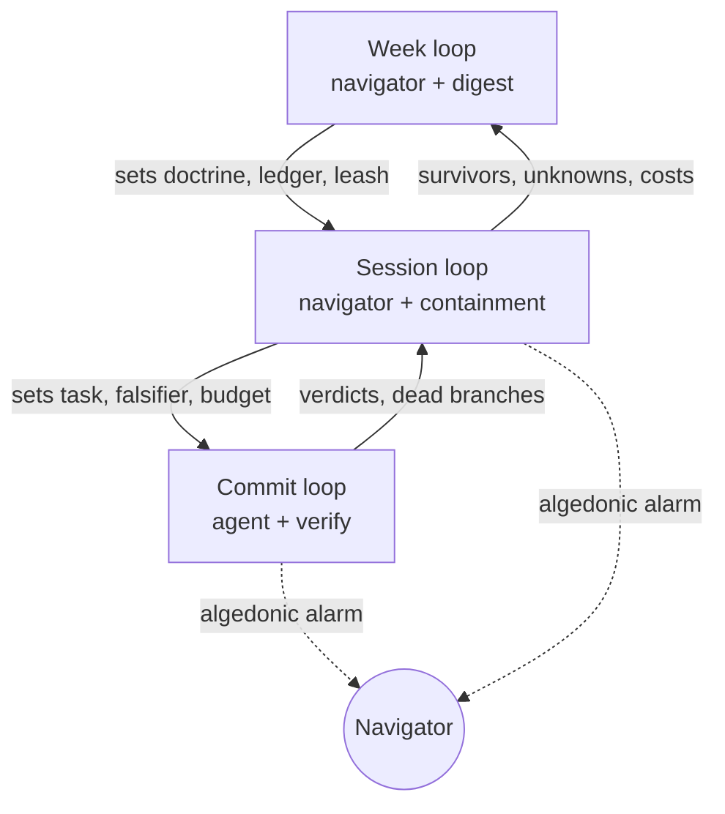

# Machine Horticulture — Navigator's Handbook

*Edition 2026-09-20 · author: Julian Smith · living document — this Markdown
file is the source; the PDF under `exports/` is a rendering of it. Audited
against the repo per [README.md](README.md); the audit notes are kept there,
not inline, so this text stays the author's.*

## Purpose and audience

This handbook tells a human how to run an agentic development process without
reading most of the code it produces. It is written for the navigator: the
person who sets goals, holds the gates, and decides what survives inside the
`autonomous` framework.

It assumes three things. The agents are competent but not trustworthy by
default. The codebase is already too large and too fast-moving for any one
person to hold at depth. The navigator's attention is the scarcest resource in
the system and must be spent deliberately.

The companion document, the [Gap Integration Schematic](GAP-SCHEMATIC.md),
covers what `autonomous` must build so that this handbook can be followed to
the letter. Where a procedure below depends on a component that does not exist
yet, it is marked with the component's name.

## The stance

Machine Horticulture treats AI as a cognitive prosthetic: neither a simple tool
nor a sovereign agent, but an extension of the navigator's cognition with seams
the navigator must always be able to locate. The work is not to erase the
seams. It is to know where they are, move them deliberately, and instrument
both sides.

The governing constraint is Ashby's law of requisite variety. A regulator can
only control a system whose variety it can match. A human reading code has a
small, fixed variety budget; a codebase under agentic development grows variety
faster than any reader can absorb. Total understanding therefore stops being a
net benefit at a predictable point, and the only moves left are to attenuate
the system's variety with constraints or amplify the regulator's with
instruments. This is why the practice looks like gardening rather than
architecture: the gardener does not design the plant, but decides what
survives.

Two metaphors set the expectations. Horticulture: outcomes are reached by
selection, pruning, and trellises, not by perfect execution. Diagnostic
medicine: failures are isolated by discriminating observations, not explained
from first principles. Both fields produce reliable results from operators who
never hold the whole system in their heads.

The navigator's habit, above all others, is adapting to the general shape of
unknowns. You will rarely know what a component is doing. You should always
know what you do not know about it, how much that ignorance could cost, and
what would tell you it had gone wrong.

## The fourteen principles

Each principle names a cybernetic root and the rule it imposes on the
navigator. Principles 1–8 govern regulation; 9–14 govern posture and
evolution.

| # | Principle | Root | Rule for the navigator |
|---|---|---|---|
| 1 | Design the seam, not the parts | Bateson's cane; extended mind | Every capability declares an interface contract and a failure surface. Know where each seam is; move seams deliberately, never erase them. |
| 2 | Keep a requisite-variety ledger | Ashby; Beer's variety engineering | No new degree of freedom (config dimension, API surface, dependency, model call) without a matched verifier dimension. Review the ledger weekly. |
| 3 | The verifier is the model | Conant–Ashby good-regulator theorem | The verify suite is your model of the system; code is territory. Invest in model fidelity (mutation score, invariants), never in comprehension. Verify never weakens. |
| 4 | Judge by what it does | Beer's POSIWID | Observed behavior outranks intent, docs, and agent reports. Every task states its falsifier before generation begins. Passing is not done. |
| 5 | Generate loosely, decide strictly | Oracle discipline | Stochastic components sit upstream of deterministic gates. Temperature in proposal, never in authorization. |
| 6 | Autonomy is proportional to reversibility | Ashby's ultrastability | Leash length is set by blast radius and rollback cost. Snapshot before, authorize deterministically. Irreversible means human-gated. |
| 7 | History is a tree | Branching state; second-order record | Nothing is overwritten. Failed branches are kept as negative results. Record how a decision was made, not only its outcome. |
| 8 | Nest the loops, separate the rates | Wiener; Beer's recursive viable systems | Fast loops inside session loops inside weekly loops, each with sensor, comparator, actuator. The human sits at the slowest loop. Seed everything. |
| 9 | Regulate the regulator, slowly and gated | Second-order cybernetics | The harness improves at a lower frequency than the work, always through a human stage. Rate separation is the defense against Goodhart. |
| 10 | Diagnose, don't explain | Diagnostic medicine | On failure, seek the minimal observations that discriminate between hypotheses. Reproduce, bisect, ablate. Isolation is enough to act. |
| 11 | Give unknowns a shape | Vertex protocol generalized | Keep a current map of what is unverified, unmodeled, and untested. Agents report uncertainty on a channel separate from output. |
| 12 | Build an algedonic channel | Beer | A pain signal bypasses the hierarchy: any level can halt the system on a threshold breach and escalate straight to the human. |
| 13 | Constrain the program space before reviewing the program | Variety attenuation | Conventions, shared libraries, and allowed dependencies are trellises. They decide which growth is possible so the verifier's job stays tractable. |
| 14 | Cultivate populations, prune with the gate | Horticulture; robust-by-replacement | Generate several candidates, verify all, keep survivors. Every component is replaceable; no tacit knowledge lives in a single session. |

## The navigator's role

The navigator is the regulator at the slowest loop. Your variety is scarce and
expensive, so it is spent on goals, gates, and doctrine, never on line-level
review by default.

**What you do**

- Set the objective and its falsifier before any generation starts.
- Set the leash: blast radius, rollback path, and which actions are
  human-gated for this task.
- Hold four gates personally: changes to the verifier, irreversible actions,
  changes to the harness (containment policy is part of the harness), and
  changes to doctrine.
- Select among verified candidates rather than correcting a single one.
- Read the uncertainty channel and the unknowns map, and decide which
  unknowns are acceptable.
- Respond to algedonic alarms. An alarm is the one thing that interrupts you
  at any loop.
- Run the weekly review of the variety ledger, the digest, and the dead
  branches.

**What you never do**

- Weaken, skip, or special-case a verify gate to get a run through.
- Accept an agent's report of what it did as evidence that it did it.
- Read a diff line by line as your default form of oversight. Reading is a
  diagnostic tool, reached for when the model (the verifier) has failed to
  discriminate.
- Let a metric be optimized by the same loop that measures it.
- Fix a component by hand when the gate could select a better candidate.
- Hold system knowledge only in your head. If it matters, it lives in the
  doctrine, the verifier, or the unknowns map.

You are permitted, and expected, to be out of your depth. The system is
designed so that being out of your depth is survivable. Your job is to keep it
that way.

## The loop structure

The system is three nested feedback loops, each with its own sensor,
comparator, and actuator, plus one flat alarm path that bypasses all of them.
Slower loops set the setpoints of faster ones; faster loops never modify
slower ones.

Solid arrows are control; dotted arrows are the algedonic channel, which
reaches the navigator from any level without passing through the level above.

| Loop | Cadence | Sensor | Comparator | Actuator | Navigator's job |
|---|---|---|---|---|---|
| Commit | seconds–minutes | lint, tests, property checks, mutation probes | verify gate (deterministic) | accept, reject, or branch the change | None. Watch only the alarm. |
| Session | minutes–hours | containment log, uncertainty channel, cost meter | task falsifier; leash limits | snapshot, rollback, halt, hand to human gate | Set task and leash; decide at gates; select survivors. |
| Week | days | digest, variety ledger, dead-branch record, unknowns map | doctrine; ledger balance; harness evaluator | adjust doctrine, stage harness changes, re-budget | Review, prune doctrine, gate harness evolution. |

Seeding is a precondition of every loop. A run that cannot be reproduced from
its seed and inputs produces no usable feedback, and its results are treated as
noise.

## Operating procedures

### Starting a task

1. Write the objective in one sentence, then write its falsifier: the
   observable that would prove the task failed. If you cannot write the
   falsifier, the task is not ready.
2. Classify the blast radius. What can this task touch, and what would
   rollback cost? This sets the leash.
3. Declare the gated actions: anything irreversible, anything that touches
   verify, anything that touches the harness.
4. Check the ledger (component: **variety ledger**). If the task adds a
   degree of freedom, name the verifier dimension that will match it before
   the agent starts.
5. Set the budget: tokens, wall-clock, and candidate count. Prefer several
   cheap candidates to one expensive one.
6. Snapshot (component: **containment layer**). No unattended run starts
   without a restore point.

### Watching a run

You do not watch the diff. You watch three signals:

- The **uncertainty channel** (component): what the agent reports it is
  unsure of, separately from its output. Rising uncertainty on a narrow task
  is a stop signal.
- The **cost meter**: spend against budget. A run consuming budget without
  verify progress is looping.
- The **algedonic channel** (component): a threshold breach halts the run and
  pages you. Treat every alarm as real until diagnosed.

Anything else the agent says is a claim, not evidence.

### Gate decisions

Four classes of change reach you personally. Decide each with one question.

| Gate | The question | Default |
|---|---|---|
| Verifier change | Does this make the model more faithful, or only make the run pass? | Reject unless mutation score rises or a new invariant is added. |
| Irreversible action | Is the rollback path real and tested? | Reject until it is. |
| Harness change, containment policy included | Has the evaluator scored it, and is it staged, not live? | Reject anything that skips staging. |
| Doctrine change | Did this come from a pattern in the digest or from one bad day? | Defer to the week loop. |

### When something fails

Do not ask what went wrong. Ask what observation would separate the two most
likely causes.

1. Reproduce from the seed. If it does not reproduce, log it to the unknowns
   map and stop; you have noise, not a fault.
2. Bisect. Branch history makes this cheap: find the last node where the
   falsifier held.
3. Ablate. Remove one component at a time until the failure disappears.
4. Act on isolation. Once the fault is localized, replace the component or add
   a verifier dimension. Understanding why is optional and usually expensive.
5. Record the dead branch and what discriminated it.

### Selecting among candidates

When the run produces a population (component: **population selection**), you
never repair the best one. You rank survivors by the verifier, then by ledger
cost, then by reported uncertainty. Ties go to the smaller diff. The rest
become dead branches with their verdicts attached.

### The weekly review

- Read the digest for patterns, not incidents.
- Balance the ledger: every variety source with a growing count and a flat
  verifier dimension is a debt to schedule.
- Walk the unknowns map: retire what got verified, promote what got worse,
  price what remains.
- Review dead branches for a repeated cause. A repeated cause is a doctrine
  candidate.
- Gate any staged harness change. Approve at most one per week, so its effect
  can be attributed.

## Anti-patterns

Each of these feels reasonable in the moment. Each violates a principle and
costs more than it saves.

| Anti-pattern | What it looks like | Principle violated | Do instead |
|---|---|---|---|
| The comprehension reflex | Reading the whole diff before accepting anything | 3 | Ask what the verifier failed to discriminate; add that dimension. |
| Green means done | Accepting a passing run as complete | 4 | Check the falsifier against observed behavior. |
| Loosening the gate | Skipping or weakening verify to unblock a run | 3, 9 | Reject the run; the gate is the model. |
| Trusting the report | Treating the agent's summary as evidence | 4 | Only the verifier and the containment log count. |
| Repairing the favorite | Hand-fixing one candidate instead of selecting | 14 | Rank survivors; prune the rest. |
| Live harness edits | Changing the harness inside the loop it governs | 9 | Stage it; evaluate; gate next week. |
| Unseeded runs | Accepting results that cannot be reproduced | 8 | Treat as noise; fix the seed first. |
| Silent freedom | Adding a config flag or dependency with no verifier match | 2 | Enter it in the ledger with its match, or don't add it. |
| Alarm fatigue | Muting or ignoring algedonic signals | 12 | Diagnose every alarm; re-tune thresholds only at the week loop. |
| Head-held doctrine | Rules that exist only in your memory | 1, 13 | Write them into the doctrine or the verifier. |
| Explaining before isolating | Building a theory of the bug before reproducing it | 10 | Reproduce, bisect, ablate. |
| Stepping out of the way | Letting the agent set its own objectives because it seems capable | 1, 6 | You remain the regulator; you moved from designer to selector, not to spectator. |

## Glossary

| Term | Meaning here |
|---|---|
| Navigator | The human regulator at the slowest loop. Sets goals, holds gates, selects survivors. |
| Seam | A boundary between human, agent, and deterministic code across which a contract is declared. |
| Variety | The number of distinguishable states a system can take (Ashby). Observer-relative. |
| Requisite variety | A regulator must match the variety of what it regulates, by attenuating the system or amplifying itself. |
| Variety ledger | The written pairing of every variety source with its verifier match, plus the trend of the gap. |
| Verifier | The deterministic gate that renders verdicts on changes. Under Conant–Ashby, it is the system's operating model. |
| Falsifier | The observable, stated before generation, that would prove a task failed. |
| Leash | The autonomy granted to a run, set by blast radius and rollback cost. |
| Containment layer | Deterministic pre-action authorization plus snapshot and rollback. Precondition for unattended runs. |
| Algedonic channel | A flat alarm path from any level directly to the navigator, bypassing the loop hierarchy (Beer). |
| Uncertainty channel | An agent's report of what it is unsure of, kept separate from its output. |
| Unknowns map | The current record of what is unverified, unmodeled, and untested, with a cost estimate per item. |
| Dead branch | A rejected or failed line of work kept in the history tree with its verdict as a negative result. |
| Population | Several candidates generated for one task and ranked by the verifier; survivors are kept, the rest pruned. |
| Harness | The tooling, prompts, and containment policy that shape agent behavior. Evolves through proposer, evaluator, and human-gated staging. |
| Digest | The week-loop summary of runs, costs, verdicts, and unknowns produced by the distillery. |
| Doctrine | The stable rules in the global instructions that all projects inherit. Changes only at the week loop. |
| POSIWID | The purpose of a system is what it does (Beer). Judge by behavior. |
| Goodhart | A measure optimized as fast as it is read stops measuring. Prevented by rate separation. |
